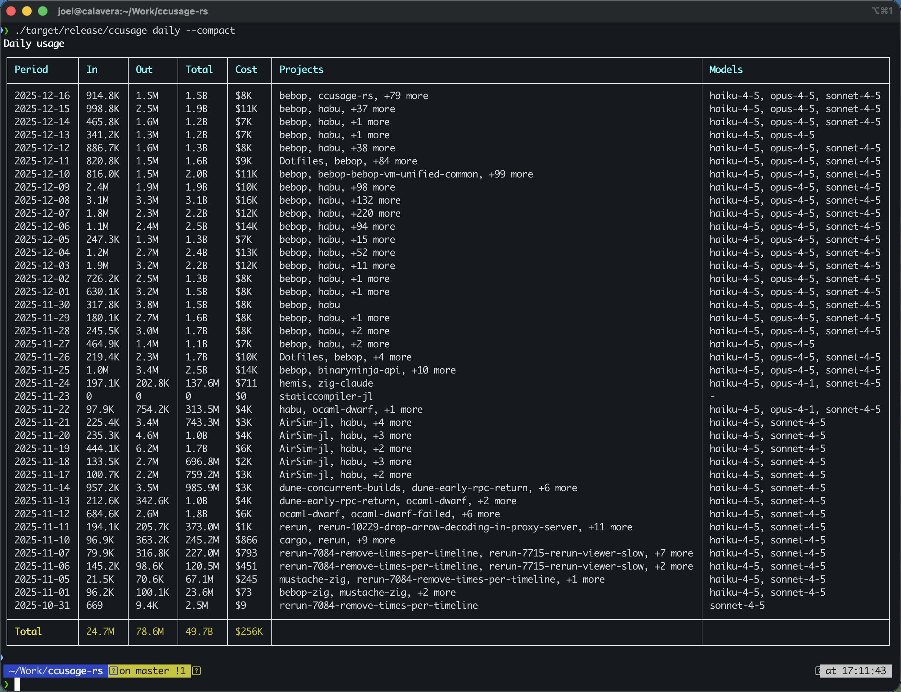
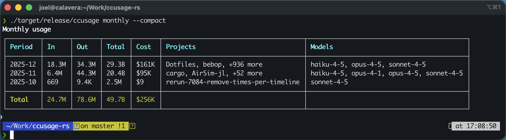

# ccusage-rs

Daily usage with per-model breakdown:



Monthly usage summary:



Rust reimplementation of [ccusage](https://github.com/ryoppippi/ccusage), the Claude Code usage analyzer. The goal is a fast, fully offline CLI that reads local Claude Code JSONL logs, calculates token usage/costs, and presents daily/monthly/session/block reports (plus live monitoring) with JSON or table output.

## Status

- CLI covers daily/weekly/monthly, sessions, 5-hour blocks (with optional live refresh), and a statusline summary.
- JSON output and tables (compact/full) with per-model breakdowns available.
- Pricing pulled from LiteLLM’s public dataset with bundled offline fallback (`--offline`); unknown models cost $0.00.
- See `PLAN.md` for milestones and architecture notes.

## Local Setup

```bash
rustup default stable           # ensure a stable toolchain
cargo run -- --help
```

## Usage

- Default search paths: `~/.config/claude/projects/` and `~/.claude/projects/`. Override with `--data-dir` (repeatable) or `CLAUDE_CONFIG_DIR=path1,path2`.
- Timezone defaults to UTC; set `--timezone America/Los_Angeles` (IANA TZ names).

```bash
# Daily (default), table output
cargo run -- daily

# Weekly view starting Monday, grouped by project
cargo run -- weekly --start-of-week monday --instances

# Monthly view, compact table
cargo run -- monthly --compact

# Sessions view
cargo run -- sessions

# 5-hour blocks with model breakdowns and live refresh every 5s
cargo run -- blocks --breakdown --live --refresh-seconds 5

# JSON output with filters
cargo run -- daily --json --since 2024-12-01 --until 2024-12-31 --project my-project

# Custom data dir and timezone
cargo run -- --data-dir ~/.config/claude --data-dir ~/extra/claude --timezone America/New_York

# Live blocks with TUI dashboard
cargo run -- blocks --live --tui

# Cost calculation mode (auto | prefer-field | calculate)
cargo run -- --cost-mode calculate blocks --json

# Statusline summary (most recent day)
cargo run -- statusline
```

### Config file (optional)

You can set defaults via a JSON file (`--config <path>`, or `./ccusage.json`, or `~/.config/ccusage/config.json`):

```json
{
  "defaults": {
    "json": false,
    "compact": false,
    "breakdown": true,
    "timezone": "America/Los_Angeles",
    "order": "desc"
  },
  "commands": {
    "daily": { "instances": true },
    "blocks": { "token_limit": 500000, "recent_days": 3, "live": false }
  }
}
```

JSON schema for configs: `config-schema.json` (use it for editor validation/autocomplete).

## High-Level Goals

- Parse Claude Code JSONL logs from both legacy (`~/.claude/projects/`) and new (`~/.config/claude/projects/`) paths.
- Aggregate usage by day, month, session, and 5-hour billing blocks.
- Estimate costs per model (incl. cache create/read tokens) with offline pricing data.
- Provide JSON output plus human-friendly tables; compact mode for narrow terminals.
- Live monitoring/dashboard for active sessions and burn-rate projections.
- Config via CLI flags, env vars, and JSON config files with schema validation.

## References

- Original TypeScript repo: https://github.com/ryoppippi/ccusage
- Project plan: `PLAN.md`
